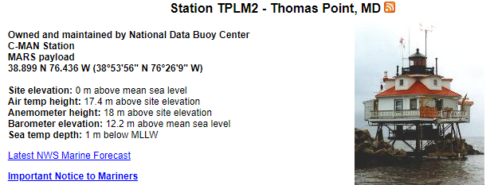
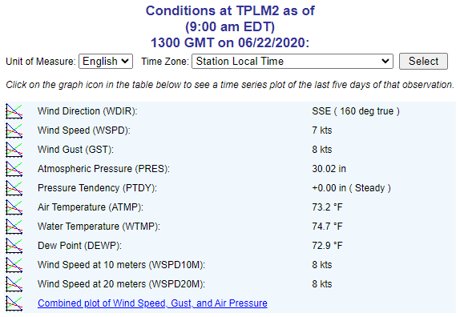
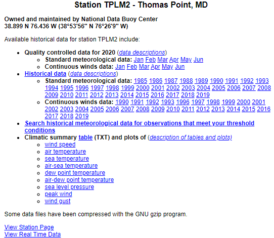
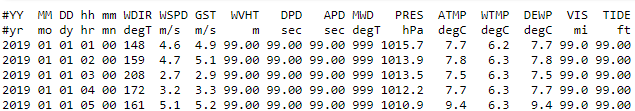
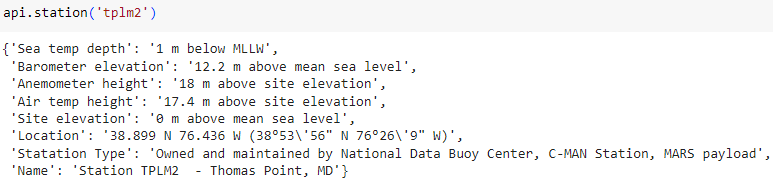
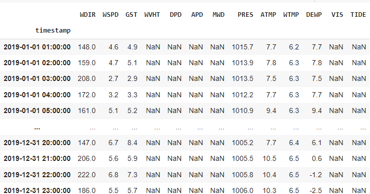

The list of under-appreciated government institutions is long; I would offer a spirited argument that NOAA is at the top.

For the unfamiliar reader, the National Oceanic and Atmospheric Administration (NOAA) is a federal agency that is responsible for monitoring and predicting the weather, climate, and oceans. Their forecasts are the best in the world, they provide critical alerts for natural disasters, they are a primary source of data for climate change research, among many other things. All of these services are provided for free to the public. The agency maintains thousands (perhaps millions) of sensors around the world and in space, and they make the data available to anyone who wants it.

Given the scope of its mission, NOAA is organized into several sub-agencies, one of which is the National Data Buoy Center (NDBC). The NDBC is responsible for deploying and maintaining a network of buoys that collect real-time data on the oceans and the atmosphere. This data informs services such as notice to mariners (NOTAM), hurricane, and tsunami warnings. The products derived from NDBC station data are critical for safety at sea and ashore, but the raw data is also useful in research. I made significant use of NDBC data in my undergraduate research, specifically as a source of truth for the ocean temperature in the vicinity of Annapolis.

<div style="text-align: center;">
  
</div>

When obtaining data from the NDBC, the primary method is to download it from their website. The website is functional, but it is not designed for programmatic access. The data is available in a variety of formats, but the most common is a text file that is updated every hour. This access mode also supposes that the users is only interested in data from one station, and that they know the station's ID. This is not a problem for most users, but it is a limitation for researchers who want to analyze data from multiple stations or who want to automate the data collection process.

To address this limitation, I developed a Python API for the NDBC. The API is designed to streamline workflows involving NDBC data, especially pulling subsets of data over an arbitrary time range, without the need to check the existence of each file, download the text, and manually handle cleaning and stacking the records. The API is available on [GitHub](https://github.com/cjellen/ndbc-api) and through [PyPI](https://pypi.org/project/ndbc-api/).

### A station as represented by the NDBC website

As an illustrative example of the workflow supported by the NDBC's website, we can consider the task of pulling the latest data from the Thomas Point Light near Annapolis, MD. We can use [the NDBC search tool](https://www.ndbc.noaa.gov/station_page.php) to find the station ID, which is `tplm2`. We can then navigate to the [station's data page](https://www.ndbc.noaa.gov/station_page.php?station=tplm2) to get a sense for the current state of the station.

<div style="text-align: center;">
  
</div>

The station page also provides some details about the most recent measurements collected at the station. Not every station has the measurement equipment or location to capture all of the data types, in fact few stations report more than continuous winds and standard meterological data. What's more, stations are often seasonal with irregular deployments and maintenance schedules.

For Thomas point, the measurements are presented in a table for each feature being measured; these can also be used to make plots of the last few hours of realtime data.

<div style="text-align: center;">
  
</div>

In order to obtain the data in a format that can be used for analysis, we need to download the text file from the station's data page. 

<div style="text-align: center;">
  
</div>

The realtime text files are updated every hour, and the historical text files after quality control are available for some or all of the month or year in their hyperlink reference. Each file is formatted as space-separated values with a header marked with a `#` character. An example for the year from 2019 is shown below.

<div style="text-align: center;">
  
</div>

If you look closely, you can see that many values are reported as `999` or `99.0`. These are placeholders for missing data, and they are common in the NDBC data files. Given the differences in the ranges each feature can take, the placeholder value is measurement-specific. There is a [full data guide](https://www.ndbc.noaa.gov/measdescrip.shtml) that describes the features, their units, and their placeholder values.

### The NDBC API

The NDBC API is designed to simplify the process of obtaining data from the NDBC. The API is built on top of the `pandas` library, which is the de facto standard for data manipulation in Python. Our example workflow above involved a significant amount of manual work to download and clean the data. With the API, the same workflow can be accomplished programmatically.

After pip installing the `ndbc-api` package, our example above is accomplished in a few lines of code.

```python3
from ndbc_api import NdbcApi


api = NdbcApi()
```

The `api` object has bound methods for common operations, such as viewing a station's metadata or retrieving data for a station over a time range. For our first example, we can use the `station` method to get the metadata for the Thomas Point Light station.

```python3
api.station('tplm2')
```
<div style="text-align: center;">
  
</div>

Next we can use the `get_data` method to retrieve the data for the Thomas Point Light station over a time range. For example, to get the data for the year 2019, we can use the following code.

```python3
api.get_data(station='tplm2', start='2019-01-01', end='2020-01-01')
```

The `get_data` method returns a `pandas.DataFrame` object with the data for the specified station and time range. The data is cleaned and formatted according to the NDBC data guide. DataFrames allow for easy manipulation and analysis of the data, and they can be easily exported to other formats such as parquet or CSV. They also expose the underlying data for each measurement as a numpy array, especially useful for plotting.

<div style="text-align: center;">
  
</div>

Under the hood, the API handles the process of building the requests for each subset of the data, downloading the text files, parsing the data, and handling time-range and measurement filtering.

### Some parting remarks

Building the NDBC API was an exceptionally rewarding experience. The API is a small project, but required just the right amount of system design and end-to-end thinking to teach me effective software engineering practices. While I did not follow test driven design all the way through, I did work to take a test-first approach to implementing the core functionality. The lessons learned and interesting patterns for testing and mocking will be the subject of a future post. This area was particularly challenging because the API is a wrapper around a web service, and the data is not static. Aiming for a high level of test coverage forced me to implement a number of design patterns that I would not have otherwise considered, as well as develop a better understanding of `pytest` and `httpretty`.

As an added bonus, the API is also a useful tool for my research, and I hope that it will be useful for others as well. The API is open-source and available on [GitHub](https://github.com/cjellen/ndbc-api) and [PyPI](https://pypi.org/project/ndbc-api/). I encourage you to check it out and let me know what you think. Issues and feature requests are welcome. If you happen to use the API in your work, I would love to hear about it.
