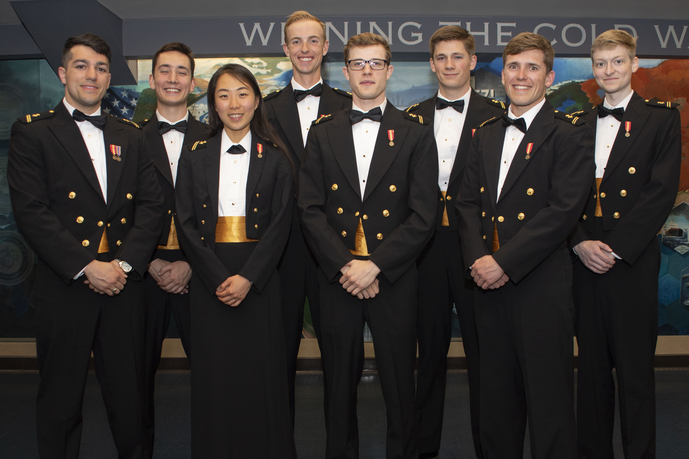
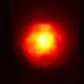
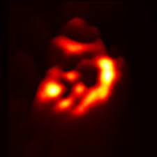
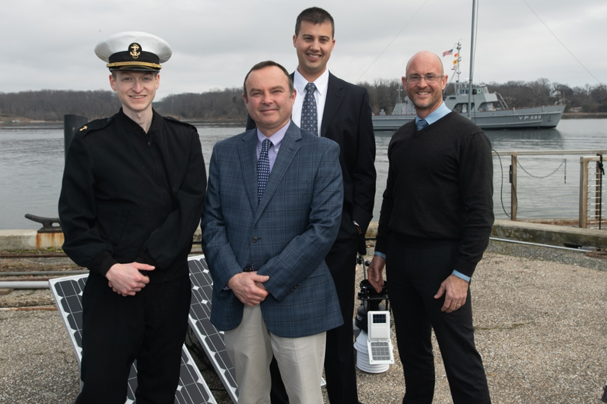

In February of 2019, I was selected as one of eight [Trident Scholars](https://www.usna.edu/TridentProgram/Overview.php) for the [United States Naval Academy](https://www.usna.edu/About/index.php) [Class of 2020](https://www.usna.edu/TridentProgram/Trident_Scholar_Classes/Class_of_2020.php).

  

### The path to selection

My path to the Trident program was disjoint, although I'm sure the other participants would say the same of their journeys to selection. The Naval Academy afforded me the opportunity to work closely with Professors across disciplines, from the liberal arts to the hard sciences. I have always enjoyed the classroom experience, but the level of mentorship, engagement, and passion that each and every member of the faculty brought to their work had a profound impact on me. From my [plebe](https://en.wikipedia.org/wiki/Plebe_Summer) year on, I took as many classes as the credit limit allowed (often more), spent time in the lab spaces, and sought out opportunities to engage with the faculty outside of the classroom. While I did not excel at every subject, especially in boxing, although I enjoyed that class too, I found profound enjoyment in the process of learning.

When selecting a major, I made the natural choice of mechanical engineering. No other major offered as many opportunities to study across disciplines and specializations. I was able to take classes in chemistry, materials science, thermodynamics, fluid dynamics, linear algebra, and even nuclear physics. In more ways than one, my major selection was in fact a way to punt on the question of what to study, and instead to study everything. I was fortunate to have the support of my academic advisors, Company Officers, friends, and family, who all encouraged me to take advantage of as many opportunities as I could. The first two years of my academic career are well-described with the word "breadth".

For better or worse, "breadth" is not a field of academic research. I understood from the start of my Second Class year that I had the opportunity to pursue a research project. Research interested me, more in the abstract than as applied to a specific question or even field. The process of focused study, in collaboration with members of the faculty, on a question that had no clear answer was appealing. Fortunately, the world and the Navy abound with unanswered questions.

My background in mechanical engineering exposed me to [computational fluid dynamics](https://en.wikipedia.org/wiki/Computational_fluid_dynamics) (CFD) and [finite element analysis](https://en.wikipedia.org/wiki/Finite_element_method) (FEA). A general interest in systems-modeling and optimization meant that I had at least heard the term "machine learning" when one of my advisors mentioned it as an area of applied study. These conversations, as I recall them, happened at the end of 2018. One of my advisors, a professor of mechanical engineering, mentioned that one of his colleagues had a project in measuring the impact of [turbulent flows](https://en.wikipedia.org/wiki/Turbulence) in the [boundary layer](https://en.wikipedia.org/wiki/Atmospheric_Boundary_layer) on the profile of a beam wave-front. The idea stuck with me for three reasons: the project was interdisciplinary, the project was applied, and the project involved learning something new.

In developing the concept into an application for the Trident program, the second reason was the most significant motivator.

  
  

The images above illustrate the impact of optical turbulence on a wavefront incident on an optical receiver. The image on the left shows a wavefront incident on an optical receiver with low turbulence, while on the right turbulent effects through the propagation distort the wavefront significantly. The extent of this distortion is of critical importance to the design and operation of high-energy and optical communication systems. These optical turbulent effects are quantified by the structure function of the refractive index, which is a measure of the spatial and temporal variability of the refractive index ($C_n^2$). At a high level, my research project was to predict the extent of optical turbulence in the near-maritime boundary layer from readily-available meteorological data.

I started a literature review with a focused on high-energy and optical communication systems, both of which are of tremendous importance to the future of the fleet. [Optical turbulence](https://en.wikipedia.org/wiki/Optical_turbulence) is a key concern in the design and operation of these systems. The community of researchers, academics, and practitioners in this field is small, but the work is of critical importance. Few papers studied the phenomenon of optical turbulence in the near-maritime boundary layer, and fewer still attempted to predict the extent of optical turbulence from readily-available meteorological data. Armed with some understanding of the problem, a limited understanding of the physics, and a few weeks of research into the nebulous field of machine learning, I submitted our application.

### Selection's lasting impact

With some time between me and my initial selection, I believe I made the cut because the project was low-risk. The measurement equipment had already been secured, I had ample room in my academic schedule, and the approximate-equivalent of a "null result" would still be of interest to the wider community. The more I've reflected on my preparation, application, and academic career up to that point, the more I've recognize the impact of my advisors and mentors on my selection. Without their intervention and direction, it is highly unlikely that I would have submitted a coherent, focused application.

My selection to the Trident program was the single most critical event in my academic career. Without even mentioning the experiences and opportunities that followed in executing on the research project, my selection meant a shift in focus from engineering to mathematics. Up to the point of my selection, I was targeting dual degrees in mechanical and nuclear engineering. While I thoroughly enjoyed my mathematics courses, I saw math as the language of engineering, rather than engineering as a structured application of math. One element of the project proposal was my course schedule for the rest of my time at the Academy. The research project itself consumed a significant number of credit hours, and I had to ensure my course work prepared me for success in that project. My proposed schedule included study in statistics, as well as deeper courses in applied mathematics. If my selection to the Trident program was the most critical event in my academic career, my experience in Honors Real Analysis was a close second. There were fewer students in that course than there were Trident Scholars, and the course was more challenging than any other I had taken. The challenge flowed from the difference in mindset and approach that is required to succeed in a proof-based course. I had to learn to think in a new way, to approach problems with a new perspective, and to communicate my understanding with rigor. Without office hours, it is highly unlikely that I would have succeeded in that course or in any other pursuit that followed. If the debt I owe to the faculty and staff at the Naval Academy is not already evident, I hope to make clear that any success I have had is due to their guidance, mentorship, and support.

The honors track in applied mathematics did help prepare me for my Trident project, but more critically it helped me see the beauty of mathematics and the power of abstraction. Geometry, topology, algebra, and groups all obtained new meaning. While this did not directly impact my research project, it did change my perspective on problem solving.

### The research project itself

After my selection in February of 2019, my focus shifted back to coursework, leadership, and the unbelievable day-to-day opportunities the Academy afforded me. Over the summer of 2019, I spent a few weeks as an [intern at MIT Lincoln Labs](https://www.ll.mit.edu/). A reflection on what I took away from that experience would be a post in itself. The experience with MATLAB, Julia, and general programming concepts was an essential foundation for my research project, although not exactly the skills I would choose to focus on today. When my final academic year started in August, I had everything I needed to succeed, with the possible exception of the discipline needed to maintain the schedule I set out.

A detailed overview of my project is out-of-scope for this post. The final product is [available at the Academy's website](https://www.usna.edu/TridentProgram/VirtualConference/index.php). The fact that I have [an entry summarizing our project](https://www.usna.edu/TridentProgram/VirtualConference/Jellen.php) is a testament to the support and guidance I received from my advisors. Their feedback, coupled with the space to fail and fail repeatedly, was critical to my success in delivering on the opportunity I was afforded. The project itself was a success, in that we were able to predict the extent of optical turbulence in the near-maritime boundary layer with a higher degree of accuracy than existing models from the iterate. Perhaps more importantly, the project helped forge my love of learning into a passion for research. The process of developing a research question, of studying the existing literature, of developing a methodology, of executing on that methodology, and of communicating the results was a transformative experience.

  

My research was initially published through the [Defense Technical Information Center](https://apps.dtic.mil/sti/pdfs/AD1136696.pdf) at the conclusion of the 2020 Trident Scholar program. I continued working with my advisors to refine the methodology and to expand the scope of the project. The project was accepted for publication in the [Applied Optics](https://scholar.google.com/citations?view_op=view_citation&hl=en&user=9ylnDfYAAAAJ&citation_for_view=9ylnDfYAAAAJ:8k81kl-MbHgC) later that summer. I've continued working in the space under my advisors, any outputs from which will be linked in my [Google Scholar profile](https://scholar.google.com/citations?user=9ylnDfYAAAAJ&hl=en).

### Some parting remarks

The Trident program at the United States Naval Academy was noting short of a series of transformational experiences. These experiences were made possible by the support and guidance of the faculty and staff at the Academy. Critically, there were more failures than successes, especially early in project execution. I learned more from these failures than I did from the successes. The process of research is not linear, and the process of learning is not either. I am grateful for the opportunity to have participated in the program, and I am grateful for the support and guidance I received from my advisors.

For any reader considering undergraduate research, you will learn something from it, regardless of the results. The process of developing a research question, of studying the existing literature, of developing a methodology, of executing on that methodology, and of communicating the results is a transformative experience. I encourage you to seek out opportunities to engage with the faculty at your institution. They want the best for you, and can often provide intellectual opportunities that do not arise organically in the classroom.

For any reader considering the Naval Academy, I encourage you to build as clear a mental picture of the opportunity and the challenge as you can. I will always owe a debt of gratitude to the institution, and every individual and team that makes the Academy what it is. I drank the Kool-Aid, and I am better for it. I hope you will be too.

Finally, for any reader considering any long-term academic or otherwise intellectual pursuit, I encourage you to collaborate and learn with others. While there certainly is a place for focused work, reading, and thought, the process of learning is inherently social. I have learned more from my peers, my advisors, and my mentors than I have from any book or lecture. I hope you will too.
